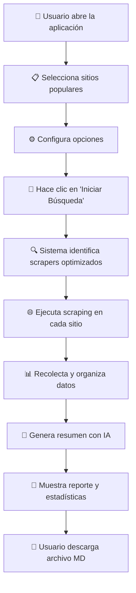

# 🎓 Explicación Completa: Buscador de Becas - Sitios Populares

## 📋 Resumen General
Esta aplicación busca becas automáticamente en los sitios web más populares usando **scrapers optimizados** para cada sitio específico. La interfaz está completamente en español y genera reportes inteligentes usando IA.

## 🔄 Flujo de la Aplicación



### 📝 Pasos Detallados:

1. **Inicio**: Usuario abre `streamlit run app.py`
2. **Selección**: Marca los sitios de becas que quiere explorar
3. **Configuración**: Ajusta opciones (navegador invisible, límites)
4. **Ejecución**: Sistema ejecuta scrapers específicos para cada sitio
5. **Procesamiento**: Recolecta información de becas de cada sitio
6. **IA**: Genera resumen organizado usando OpenAI
7. **Resultados**: Muestra estadísticas y permite descargar reporte

---

## 📁 Explicación Detallada de Archivos

### 🎯 **app.py** - Aplicación Principal
**Función**: Interfaz de usuario y orquestador principal

**¿Qué hace?**
- Crea la interfaz visual con Streamlit
- Maneja la barra lateral con opciones
- Coordina todo el proceso de scraping
- Muestra resultados y estadísticas
- Gestiona la descarga de reportes

**Componentes clave:**
```python
# Barra lateral - Configuración del usuario
with st.sidebar:
    st.title("🎓 Buscador de Becas")
    selected_sites = st.multiselect(...)  # Selección de sitios
    use_headless = st.toggle(...)         # Opciones del navegador
    model = st.selectbox(...)             # Modelo de IA
```

**Flujo interno:**
1. Muestra opciones al usuario
2. Valida selecciones (sitios + API key)
3. Llama a `scrape_popular_sites()` para hacer scraping
4. Procesa resultados y calcula estadísticas
5. Llama a `generate_markdown_summary()` para crear reporte
6. Muestra resultados y botón de descarga

---

### 🏢 **scraping/site_scrapers.py** - Scrapers Específicos
**Función**: Contiene scrapers optimizados para cada sitio popular

**¿Qué hace?**
- Define scrapers específicos para cada sitio web
- Cada scraper conoce la estructura particular de su sitio
- Extrae información con alta precisión

**Estructura:**
```python
class ScholarshipAmericaScraper:
    def scrape(self, url):
        # Lógica específica para scholarshipamerica.org
        # Conoce exactamente dónde buscar títulos, montos, etc.

class FastwebScraper:
    def scrape(self, url):
        # Lógica específica para fastweb.com
```

**Sitios incluidos:**
- Scholarship America
- Fastweb  
- College Board
- Scholarships.com
- Cappex
- Unigo
- Niche
- Peterson's
- GoCollege
- ScholarshipPoints

**Ventaja clave**: Cada scraper está diseñado específicamente para la estructura HTML de su sitio, lo que da **mucha mayor precisión** que un scraper genérico.

---

### 🎯 **scraping/hybrid_scraper.py** - Coordinador de Scraping
**Función**: Coordina el scraping de sitios populares

**¿Qué hace?**
- Obtiene la lista de sitios populares
- Para cada sitio seleccionado por el usuario:
  - Encuentra el scraper optimizado correspondiente
  - Ejecuta el scraping específico
  - Marca los resultados con metadata (tipo de scraper usado)

**Funciones principales:**
```python
def get_popular_sites():
    # Devuelve diccionario {nombre_sitio: url}
    
def scrape_popular_sites(selected_sites, headless=True):
    # 1. Obtiene URLs de los sitios seleccionados
    # 2. Para cada URL, encuentra su scraper específico
    # 3. Ejecuta scraping optimizado
    # 4. Retorna lista de becas encontradas
```

**Flujo interno:**
1. Recibe lista de sitios seleccionados por usuario
2. Convierte nombres a URLs usando `POPULAR_SCHOLARSHIP_SITES`
3. Para cada URL:
   - Busca scraper específico con `get_scraper_for_url()`
   - Si encuentra scraper optimizado → lo usa
   - Si no encuentra → registra como no disponible
4. Agrega metadata a cada resultado (método usado, tipo de scraper)
5. Retorna todas las becas encontradas

---

### 🔧 **scraping/scraper.py** - Funciones Base
**Función**: Herramientas básicas de scraping que usan los scrapers específicos

**¿Qué hace?**
- Configura el navegador Chrome
- Proporciona funciones de utilidad para extraer información
- Define estructura de datos de becas

**Componentes importantes:**
```python
@dataclass
class Scholarship:
    title: str      # Título de la beca
    location: str   # País/región
    coverage: str   # Qué cubre (matrícula, gastos, etc.)
    amount: str     # Monto ($5,000, etc.)
    type: str       # Tipo (pregrado, posgrado, etc.)
    url: str        # URL de detalles
    source_url: str # URL original

def _construir_driver(headless=True):
    # Configura navegador Chrome con opciones optimizadas
    
def _extraer_texto(elemento):
    # Limpia y extrae texto de elementos HTML
    
def _adivinar_monto(texto):
    # Busca patrones de dinero ($1,000, USD 500, etc.)
```

**Funciones de utilidad:**
- `_mejor_titulo()`: Encuentra el mejor título en una página
- `_buscar_por_pistas()`: Busca información usando palabras clave
- `_adivinar_monto()`: Detecta cantidades de dinero

---

### 🤖 **utils/openai_client.py** - Generación de Reportes
**Función**: Usa IA para generar reportes organizados y legibles

**¿Qué hace?**
- Toma los datos crudos de becas
- Los envía a OpenAI con prompts específicos
- Recibe un reporte en Markdown organizado y profesional

**Proceso:**
```python
def generate_markdown_summary(scholarships, openai_api_key, model):
    # 1. Prepara los datos de becas
    # 2. Crea prompt específico en español
    # 3. Envía a OpenAI
    # 4. Procesa respuesta
    # 5. Retorna Markdown formateado
```

**Valor agregado:**
- Organiza las becas por categorías
- Crea resúmenes ejecutivos
- Formatea información de manera profesional
- Traduce y contextualiza información al español

---

## ⚙️ Configuración y Variables

### 🔐 Variables de Entorno (.env)
```env
OPENAI_API_KEY=tu_clave_api_aqui
```

### 📦 Dependencias Principales (requirements.txt)
- `streamlit`: Interfaz web
- `selenium`: Automatización del navegador  
- `beautifulsoup4`: Parsing de HTML
- `openai`: Cliente de IA
- `webdriver-manager`: Gestión automática de ChromeDriver

---

## 🎯 Ventajas del Enfoque Actual

### ✅ **Precisión Alta**
- Cada sitio tiene su scraper específico
- Conoce exactamente dónde buscar información
- Menos falsos positivos o información incorrecta

### ✅ **Mantenimiento Focalizado**
- Si un sitio cambia, solo se actualiza su scraper
- No afecta el funcionamiento de otros sitios
- Cambios aislados y controlados

### ✅ **Experiencia de Usuario Simple**
- Solo selecciona sitios de una lista
- No necesita conocer URLs
- Interfaz completamente en español

### ✅ **Reportes Inteligentes**
- IA organiza y contextualiza información
- Formato profesional y descargable
- Estadísticas detalladas del proceso

---

## 🚀 Cómo Usar la Aplicación

### 1. **Preparación**
```bash
# Instalar dependencias
pip install -r requirements.txt

# Crear archivo .env con API key
echo "OPENAI_API_KEY=tu_clave" > .env
```

### 2. **Ejecución**
```bash
streamlit run app.py
```

### 3. **Uso**
1. **Seleccionar sitios**: Marca los sitios que quieres explorar
2. **Configurar**: Ajusta opciones de navegador y modelo de IA
3. **Ejecutar**: Clic en "Iniciar Búsqueda"
4. **Revisar**: Ve estadísticas y preview del reporte
5. **Descargar**: Descarga el archivo .md con todas las becas

---

## 📊 Ejemplo de Salida

### Estadísticas Mostradas:
- Total de becas encontradas
- URLs procesadas exitosamente  
- Tasa de precisión (scrapers optimizados vs generales)
- Tiempo de procesamiento
- Desglose por tipo de scraper usado

### Reporte Generado:
```markdown
# Reporte de Becas - [Fecha]

## Resumen Ejecutivo
Se encontraron 45 oportunidades de becas...

## Becas por Categoría

### Becas de Pregrado
1. **Beca Nacional de Excelencia**
   - Monto: $5,000 USD
   - Cobertura: Matrícula parcial
   - Ubicación: Estados Unidos
   - [Ver detalles](...)

### Becas de Posgrado
...
```

---

## 🔧 Posibles Personalizaciones

### Agregar Nuevos Sitios:
1. Crear nuevo scraper en `site_scrapers.py`
2. Agregarlo al diccionario `SITE_SCRAPERS`
3. Añadir URL a `POPULAR_SCHOLARSHIP_SITES`

### Modificar Prompts de IA:
- Editar prompts en `openai_client.py`
- Cambiar formato de salida
- Ajustar idioma o estilo

### Personalizar Interfaz:
- Modificar textos en `app.py`
- Cambiar colores/tema en `.streamlit/config.toml`
- Agregar nuevas métricas o visualizaciones

---

Esta aplicación está optimizada para ser **precisa**, **fácil de usar** y **fácil de mantener**. El enfoque de scrapers específicos por sitio garantiza la mejor calidad de datos posible. 🎯