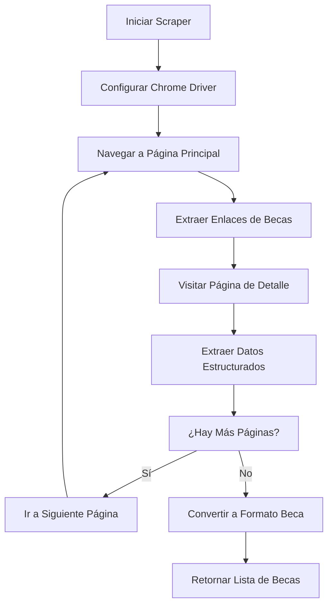

# Presentación: Scraper DAAD para Becas Académicas

## 📋 Información General

**Proyecto**: Web Scraping de Becas DAAD  
**Archivo**: `scraping/scraping_esp/wscraper_daad.py`  
**Objetivo**: Extraer información automatizada de becas del Servicio Alemán de Intercambio Académico (DAAD)  
**URL Objetivo**: https://www2.daad.de/deutschland/stipendium/datenbank/en/21148-scholarship-database/

---

## 🏗️ Arquitectura del Scraper

### 1. Estructura General

```python
# Componentes principales:
├── @dataclass Beca              # Estructura de datos estandarizada
├── class DAADScraper            # Scraper principal
├── def scrape_daad_scholarships # Función de entrada pública
```

### 2. Flujo de Trabajo



---

## 🔧 Componentes Técnicos

### 1. Estructura de Datos

```python
@dataclass
class Beca:
    title: str       # Título de la beca
    location: str    # Ubicación/país (Default: "Germany")
    coverage: str    # Qué cubre la beca
    amount: str      # Monto económico
    type: str        # Tipo/programa de beca
    url: str         # URL de detalles
    source_url: str  # URL origen
```

**Ventajas**:
- ✅ Estructura estandarizada
- ✅ Compatible con otros scrapers del proyecto
- ✅ Fácil conversión a JSON/CSV

### 2. Configuración del Driver

```python
def _init_driver(self):
    options = webdriver.ChromeOptions()
    if self.headless:
        options.add_argument('--headless=new')
    options.add_argument('--no-sandbox')
    options.add_argument('--disable-dev-shm-usage')
    options.add_argument('--window-size=1920,1080')
```

**Características**:
- 🚀 Modo headless para servidor
- 🔒 Configuración segura (--no-sandbox)
- 📱 Viewport estándar (1920x1080)
- ⏱️ Timeout de 30 segundos

---

## 🎯 Proceso de Extracción

### 1. Navegación y Paginación

```python
# Estrategia de paginación robusta
while current_page <= self.max_pages and current_url:
    # 1. Cargar página
    self.driver.get(current_url)
    
    # 2. Esperar contenido dinámico
    WebDriverWait(self.driver, 10).until(
        EC.presence_of_element_located((By.CSS_SELECTOR, '.entry'))
    )
    
    # 3. Extraer enlaces
    scholarship_links = self._extract_scholarship_links(soup)
    
    # 4. Buscar botón "Next"
    next_button = self.driver.find_element(By.XPATH, "//a[contains(text(), 'Next')]")
```

### 2. Extracción de Enlaces

```python
def _extract_scholarship_links(self, soup: BeautifulSoup) -> List[str]:
    entries = soup.find_all('div', class_='entry')
    for entry in entries:
        link_element = entry.find('a')
        absolute_link = urljoin(self.start_url, href)
```

**Técnicas usadas**:
- 🔍 Selector CSS específico: `div.entry`
- 🌐 URLs absolutas con `urljoin()`
- 🧹 Limpieza de fragmentos URL

### 3. Extracción de Datos Detallados

```python
def _extract_scholarship_data(self, soup: BeautifulSoup, data: Dict[str, Any]):
    # 1. Buscar título
    title_elem = soup.find('h2', class_='title')
    
    # 2. Encontrar contenedor principal
    detail_container = soup.find('div', class_='stipdb-detail')
    
    # 3. Procesar secciones H3
    for h3 in h3_elements:
        h3_text = h3.get_text(strip=True).lower()
        content = self._get_content_after_h3(h3)
```

---

## 🧠 Sistema de Clasificación Inteligente

### Keywords para Categorización

```python
# Información financiera
if any(keyword in h3_text for keyword in ['value', 'amount', 'stipend', 'benefit']):
    # Buscar valores monetarios con regex
    money_match = re.search(r'[\d,\.]+\s*(?:€|\$|Euro|US\$|GBP|EUR)', content)

# Tipo de programa
elif any(keyword in h3_text for keyword in ['programme', 'target', 'field', 'study']):
    data['type'] = content[:150]

# Requisitos
elif any(keyword in h3_text for keyword in ['require', 'academic', 'application']):
    coverage_parts.append(f"Requirements: {content[:100]}")
```

### Extracción de Contenido H3

```python
def _get_content_after_h3(self, h3_element) -> str:
    content_parts = []
    for sibling in h3_element.find_next_siblings():
        if sibling.name == 'h3':  # Parar en el siguiente H3
            break
        if sibling.name in ['p', 'ul', 'ol', 'div']:
            text = sibling.get_text(separator=' ', strip=True)
            content_parts.append(text)
```

**Ventajas**:
- 🎯 Extracción precisa entre secciones
- 🚫 Filtrado automático de navegación/footer
- 📏 Límites de contenido para evitar spam

---

## ⚡ Optimizaciones de Performance

### 1. Rate Limiting
```python
time.sleep(self.sleep_time)  # Default: 0.5 segundos
```

### 2. Timeouts Inteligentes
```python
WebDriverWait(self.driver, self.wait_time).until(
    EC.presence_of_element_located((By.CLASS_NAME, 'stipdb-detail'))
)
```

### 3. Manejo de Errores Robusto
```python
try:
    # Scraping logic
except TimeoutException:
    print(f"[DAAD] Timeout loading page")
    continue  # Continúa con la siguiente página
except Exception as e:
    print(f"[DAAD] Error: {e}")
    return default_data
```

---

## 🚀 Uso del Scraper

### Función Principal

```python
def scrape_daad_scholarships(headless: bool = True, max_pages: int = 3) -> List[Dict[str, Any]]:
    """
    Ejecuta el proceso completo de scraping DAAD
    
    Args:
        headless: Si ejecutar el navegador en modo headless
        max_pages: Máximo número de páginas a extraer
    
    Returns:
        Lista de diccionarios de becas
    """
```

### Ejemplo de Uso

```python
# Importar el scraper
from scraping.scraping_esp.wscraper_daad import scrape_daad_scholarships

# Ejecutar scraping
becas = scrape_daad_scholarships(headless=True, max_pages=3)

# Resultado
print(f"Encontradas {len(becas)} becas")
for beca in becas[:3]:
    print(f"- {beca['title']}: {beca['amount']}")
```

### Salida Esperada

```python
[
    {
        'title': 'Research Grants - Doctoral Programmes in Germany',
        'location': 'Germany',
        'coverage': 'Amount: 1,200 EUR per month | Requirements: Bachelor degree',
        'amount': '1,200 EUR',
        'type': 'Research and doctoral programmes',
        'url': 'https://www2.daad.de/deutschland/stipendium/...',
        'source_url': 'https://www2.daad.de/deutschland/stipendium/datenbank/...'
    }
]
```

---

## 📊 Métricas y Rendimiento

### Configuración por Defecto
- **Páginas máximas**: 3
- **Sleep entre requests**: 0.5 segundos
- **Timeout de página**: 30 segundos
- **Timeout de elementos**: 10 segundos

### Rendimiento Estimado
- **Tiempo por página**: ~20-30 segundos
- **Becas por página**: ~10-20 becas
- **Total estimado**: 30-60 becas en ~2-3 minutos

### Logs de Progreso
```
[DAAD] Starting scraping with max_pages=3
[DAAD] Scraping page 1
[DAAD] Found 15 scholarship links on page 1
[DAAD] Extracted 12 valid scholarships from page 1
[DAAD] Scraping page 2
[DAAD] Found 18 scholarship links on page 2
[DAAD] Extracted 15 valid scholarships from page 2
[DAAD] Scraping completed. Found 27 scholarships
```

---

## 🔧 Mantenimiento y Troubleshooting

### Problemas Comunes

1. **Driver de Chrome no encontrado**
   ```bash
   # Solución: Instalar webdriver-manager
   pip install webdriver-manager
   ```

2. **Timeout en páginas**
   ```python
   # Aumentar timeout
   scraper = DAADScraper(wait_time=20)  # 20 segundos
   ```

3. **Cambios en estructura HTML**
   - Verificar selectores CSS: `.entry`, `.stipdb-detail`
   - Actualizar keywords de clasificación
   - Revisar estructura de paginación

### Puntos de Extensión

1. **Agregar nuevos campos**:
   - Modificar clase `Beca`
   - Añadir keywords al sistema de clasificación

2. **Mejorar extracción**:
   - Añadir más patrones regex
   - Expandir keywords de categorización

3. **Integración con base de datos**:
   - Añadir método `save_to_database()`
   - Implementar deduplicación por URL

---

## 🎯 Ventajas de Esta Implementación

### ✅ Fortalezas

1. **Simplicidad**: Fácil de entender y modificar
2. **Robustez**: Manejo completo de errores
3. **Flexibilidad**: Parámetros configurables
4. **Escalabilidad**: Estructura modular
5. **Mantenibilidad**: Código bien documentado

### 🔄 Comparación con Versión Anterior

| Aspecto | Versión Anterior | Versión Actual |
|---------|-----------------|----------------|
| Complejidad | Alta (mapeo dinámico) | Baja (keywords simples) |
| Mantenibilidad | Difícil | Fácil |
| Performance | Selenium + Requests | Solo Selenium |
| Configurabilidad | Fija (120 links) | Variable (max_pages) |
| Debugging | Complejo | Simple |

---

## 🚀 Demostración en Vivo

### Script de Demo
```python
# demo_daad.py
from scraping.scraping_esp.wscraper_daad import scrape_daad_scholarships

print("🚀 Iniciando demo del scraper DAAD...")
print("=" * 50)

# Configuración para demo (solo 1 página)
becas = scrape_daad_scholarships(headless=False, max_pages=1)

print(f"\n📊 Resultados:")
print(f"Total de becas encontradas: {len(becas)}")
print("\n📋 Primeras 3 becas:")

for i, beca in enumerate(becas[:3], 1):
    print(f"\n{i}. {beca['title']}")
    print(f"   💰 Monto: {beca['amount']}")
    print(f"   📍 Ubicación: {beca['location']}")
    print(f"   📝 Tipo: {beca['type'][:50]}...")
    print(f"   🔗 URL: {beca['url'][:60]}...")
```

### Ejecución
```bash
cd /path/to/project
source proy_env/bin/activate
python demo_daad.py
```

---

## 📝 Conclusiones

1. **Objetivo Cumplido**: Extracción automatizada y estructurada de becas DAAD
2. **Tecnologías Clave**: Selenium + BeautifulSoup + Regex
3. **Arquitectura Robusta**: Manejo de errores y configuración flexible
4. **Código Mantenible**: Documentación completa y estructura simple
5. **Integración Perfecta**: Compatible con el ecosistema del proyecto

**¡El scraper está listo para producción! 🎉**