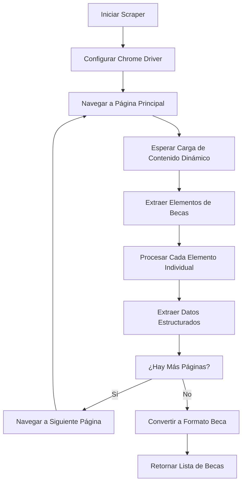

# Presentación: Scraper Scholarship America para Becas Académicas

## 📋 Información General

**Proyecto**: Web Scraping de Becas Scholarship America  
**Archivo**: `scraping/scraping_esp/wscraper_scholarship_america.py`  
**Objetivo**: Extraer información automatizada de becas de la organización Scholarship America  
**URL Objetivo**: https://scholarshipamerica.org/students/browse-scholarships/

---

## 🏗️ Arquitectura del Scraper

### 1. Estructura General

```python
# Componentes principales:
├── @dataclass Beca                           # Estructura de datos estandarizada
├── class ScholarshipAmericaScraper          # Scraper principal
├── def scrape_scholarship_america_scholarships # Función de entrada pública
```

### 2. Flujo de Trabajo



---

## 🔧 Componentes Técnicos

### 1. Estructura de Datos

```python
@dataclass
class Beca:
    title: str       # Título de la beca
    location: str    # Ubicación/país (Default: "United States")
    coverage: str    # Qué cubre la beca + fecha límite
    amount: str      # Monto económico
    type: str        # Tipo/institución de beca
    url: str         # URL de detalles
    source_url: str  # URL origen
```

**Ventajas**:
- ✅ Estructura estandarizada compatible con DAAD scraper
- ✅ Ubicación por defecto: "United States"
- ✅ Combinación inteligente de datos en `coverage`
- ✅ Fácil conversión a JSON/CSV

### 2. Configuración del Driver

```python
def _init_driver(self):
    options = webdriver.ChromeOptions()
    if self.headless:
        options.add_argument('--headless=new')
    options.add_argument('--no-sandbox')
    options.add_argument('--disable-dev-shm-usage')
    options.add_argument('--window-size=1920,1080')
```

**Características**:
- 🚀 Modo headless moderno (`--headless=new`)
- 🔒 Configuración segura para servidores
- 📱 Viewport optimizado (1920x1080)
- ⏱️ Timeout configurable de 30 segundos

---

## 🎯 Proceso de Extracción

### 1. Navegación con Paginación Dinámica

```python
# Estrategia de paginación basada en botones numerados
while current_page <= self.max_pages:
    # 1. Cargar página actual
    self.driver.get(self.start_url)
    
    # 2. Esperar contenido dinámico (importante para este sitio)
    WebDriverWait(self.driver, 10).until(
        EC.presence_of_element_located((By.CLASS_NAME, "mgpb-listing-item__content"))
    )
    time.sleep(2)  # Espera adicional para JavaScript
    
    # 3. Buscar botón de página específica
    next_button = WebDriverWait(self.driver, 5).until(
        EC.element_to_be_clickable((By.CSS_SELECTOR, f'a.facetwp-page[data-page="{next_page_num}"]'))
    )
    next_button.click()
```

**Características técnicas**:
- 🎯 **Selector específico**: `mgpb-listing-item__content`
- ⏱️ **Doble timeout**: WebDriverWait + sleep adicional
- 🖱️ **Click dinámico**: Botones con `data-page` attribute
- 🔄 **Navegación inteligente**: Detecta cuando no hay más páginas

### 2. Extracción de Elementos de Becas

```python
def _extract_scholarships_from_page(self, soup: BeautifulSoup) -> List[Dict[str, Any]]:
    # Encontrar todos los contenedores de becas
    items = soup.find_all('div', class_='mgpb-listing-item__content')
    
    for item in items:
        scholarship_data = self._extract_scholarship_data(item)
        if scholarship_data and scholarship_data.get('title'):
            scholarships.append(scholarship_data)
```

**Ventajas de este enfoque**:
- 🔍 **Selector preciso**: Basado en la estructura DOM real
- ✅ **Validación de datos**: Solo procesa becas válidas
- 📊 **Logging detallado**: Informa cuántos elementos encontró

---

## 📊 Extracción Detallada de Datos

### 1. Extracción del Título y URL

```python
# Extraer título del encabezado
title_elem = item.find('a', class_='mgpb-listing-item__heading')
if title_elem:
    data['title'] = title_elem.get_text(strip=True)
    # Extraer URL del mismo elemento
    href = title_elem.get('href')
    if href:
        data['url'] = href if href.startswith('http') else f"https://scholarshipamerica.org{href}"
```

### 2. Sistema de Extracción por Lista de Detalles

```python
# Encontrar la lista de detalles
details_list = item.find('ul', class_='mgpb-listing-item__scholarship-details')
if details_list:
    list_items = details_list.find_all('li')
    
    for li in list_items:
        li_text = li.get_text(strip=True)
        
        # Sistema de clasificación por palabras clave
        if 'Award Amount' in li_text:
            # Extraer monto usando estructura span
            amount_span = li.find_all('span')
            if len(amount_span) >= 2:
                amount = amount_span[-1].get_text(strip=True)
                data['amount'] = amount
                data['coverage'] = amount
```

**Estructura HTML detectada**:
```html
<ul class="mgpb-listing-item__scholarship-details">
    <li><span>Award Amount:</span><span>$5,000</span></li>
    <li><span>Deadline:</span><span>March 15, 2024</span></li>
    <li><span>Institutions:</span><span>4-year colleges</span></li>
    <li><span>State/Territory:</span><span>National</span></li>
</ul>
```

### 3. Clasificación Inteligente de Información

```python
# Extraer Monto del Premio
if 'Award Amount' in li_text:
    data['amount'] = amount_span[-1].get_text(strip=True)
    data['coverage'] = amount

# Extraer Fecha Límite y agregar a cobertura
elif 'Deadline' in li_text:
    deadline = deadline_span[-1].get_text(strip=True)
    if data['coverage']:
        data['coverage'] += f" | Deadline: {deadline}"
    else:
        data['coverage'] = f"Deadline: {deadline}"

# Extraer Instituciones (tipo)
elif 'Institutions' in li_text:
    data['type'] = inst_span[-1].get_text(strip=True)

# Extraer Estado/Territorio (ubicación)
elif 'State/Territory' in li_text:
    state = state_span[-1].get_text(strip=True)
    if state.lower() != 'national':
        data['location'] = f"United States ({state})"
    else:
        data['location'] = "United States (National)"
```

### 4. Extracción de Descripción

```python
# Extraer extracto/descripción y agregar a cobertura si está disponible
excerpt = item.find('div', class_='mgpb-listing-item__excerpt')
if excerpt:
    excerpt_text = excerpt.get_text(strip=True)
    if excerpt_text and len(excerpt_text) > 10:
        if data['coverage']:
            data['coverage'] += f" | {excerpt_text[:150]}..."
        else:
            data['coverage'] = excerpt_text[:150] + "..."
```

---

## ⚡ Optimizaciones de Performance

### 1. Manejo de Contenido Dinámico

```python
# Esperar a que cargue el contenido
WebDriverWait(self.driver, self.wait_time).until(
    EC.presence_of_element_located((By.CLASS_NAME, "mgpb-listing-item__content"))
)
time.sleep(2)  # Espera extra para contenido dinámico
```

**Por qué es necesario**:
- 🌐 **JavaScript pesado**: El sitio carga contenido via AJAX
- ⏱️ **Timing crítico**: Sin esta espera, los elementos no aparecen
- 🔄 **Estabilidad**: Reduce errores de elementos no encontrados

### 2. Rate Limiting Considerado

```python
time.sleep(self.sleep_time)  # Default: 0.5 segundos
```

### 3. Navegación Robusta entre Páginas

```python
try:
    # Encontrar y hacer clic en el botón de siguiente página
    next_button = WebDriverWait(self.driver, 5).until(
        EC.element_to_be_clickable((By.CSS_SELECTOR, f'a.facetwp-page[data-page="{next_page_num}"]'))
    )
    next_button.click()
    time.sleep(self.sleep_time)
    current_page += 1
except:
    print(f"[ScholarshipAmerica] No more pages available")
    break
```

---

## 🚀 Uso del Scraper

### Función Principal

```python
def scrape_scholarship_america_scholarships(headless: bool = True, max_pages: int = 3) -> List[Dict[str, Any]]:
    """
    Ejecuta el proceso completo de scraping de Scholarship America
    
    Args:
        headless: Si ejecutar el navegador en modo headless
        max_pages: Máximo número de páginas a extraer
    
    Returns:
        Lista de diccionarios de becas
    """
```

### Ejemplo de Uso

```python
# Importar el scraper
from scraping.scraping_esp.wscraper_scholarship_america import scrape_scholarship_america_scholarships

# Ejecutar scraping (modo visible para demo)
becas = scrape_scholarship_america_scholarships(headless=False, max_pages=2)

# Resultado
print(f"Encontradas {len(becas)} becas de Scholarship America")
for beca in becas[:3]:
    print(f"- {beca['title']}")
    print(f"  💰 {beca['amount']} | 📍 {beca['location']}")
```

### Salida Esperada

```python
[
    {
        'title': 'The Coca-Cola Scholars Program Scholarship',
        'location': 'United States (National)',
        'coverage': '$20,000 | Deadline: October 31, 2023 | The Coca-Cola Scholars Program Scholarship is an achievement-based scholarship awarded to graduating high school seniors...',
        'amount': '$20,000',
        'type': '4-year colleges and universities',
        'url': 'https://scholarshipamerica.org/students/browse-scholarships/coca-cola-scholars-program-scholarship/',
        'source_url': 'https://scholarshipamerica.org/students/browse-scholarships/'
    }
]
```

---

## 📊 Métricas y Rendimiento

### Configuración por Defecto
- **Páginas máximas**: 3
- **Sleep entre requests**: 0.5 segundos
- **Timeout de página**: 30 segundos
- **Timeout de elementos**: 10 segundos
- **Timeout de clicks**: 5 segundos

### Rendimiento Estimado
- **Tiempo por página**: ~15-25 segundos
- **Becas por página**: ~8-12 becas
- **Total estimado**: 24-36 becas en ~1-2 minutos

### Logs de Progreso

```
[ScholarshipAmerica] Starting scraping with max_pages=3
[ScholarshipAmerica] Scraping page 1
[ScholarshipAmerica] Found 10 scholarship items in HTML
[ScholarshipAmerica] Found 8 scholarships on page 1
[ScholarshipAmerica] Scraping page 2
[ScholarshipAmerica] Found 12 scholarship items in HTML
[ScholarshipAmerica] Found 10 scholarships on page 2
[ScholarshipAmerica] Scraping page 3
[ScholarshipAmerica] Found 9 scholarship items in HTML
[ScholarshipAmerica] Found 7 scholarships on page 3
[ScholarshipAmerica] Scraping completed. Found 25 scholarships
```

---

## 🔧 Características Técnicas Distintivas

### 1. Estructura DOM Específica

**Selectores únicos de Scholarship America**:
```css
.mgpb-listing-item__content          /* Contenedor principal */
.mgpb-listing-item__heading          /* Título y enlace */
.mgpb-listing-item__scholarship-details  /* Lista de detalles */
.mgpb-listing-item__excerpt          /* Descripción */
a.facetwp-page[data-page="X"]        /* Botones de paginación */
```

### 2. Paginación Avanzada

```python
# Sistema de paginación por números de página específicos
next_button = WebDriverWait(self.driver, 5).until(
    EC.element_to_be_clickable((By.CSS_SELECTOR, f'a.facetwp-page[data-page="{next_page_num}"]'))
)
```

**Ventajas**:
- 🎯 **Navegación precisa**: Va directamente a página específica
- 🔄 **No depende de "Next"**: Usa números de página
- ⚡ **Más rápido**: No necesita buscar botón "siguiente"

### 3. Combinación Inteligente de Datos

```python
# Combina múltiples fuentes en 'coverage'
if data['coverage']:
    data['coverage'] += f" | Deadline: {deadline}"
else:
    data['coverage'] = f"Deadline: {deadline}"

# Agrega descripción si está disponible
if excerpt_text:
    data['coverage'] += f" | {excerpt_text[:150]}..."
```

**Resultado**: Campo `coverage` rico en información:
- 💰 Monto de la beca
- 📅 Fecha límite
- 📝 Descripción resumida

---

## 🔍 Comparación: Scholarship America vs DAAD

| Aspecto | Scholarship America | DAAD |
|---------|-------------------|------|
| **Estructura HTML** | Contenedores estructurados | Secciones H3 dinámicas |
| **Paginación** | Botones numerados con `data-page` | Botones "Next" genéricos |
| **Contenido dinámico** | Mucho JavaScript, requiere waits | Contenido más estático |
| **Extracción de datos** | Lista estructurada `<ul><li>` | Navegación por siblings H3 |
| **Clasificación** | Palabras clave exactas ("Award Amount") | Keywords aproximadas ("amount", "value") |
| **Ubicación default** | "United States" | "Germany" |
| **Complejidad DOM** | Media - estructura predecible | Alta - estructura variable |

---

## 🛠️ Mantenimiento y Troubleshooting

### Problemas Comunes

1. **Contenido no carga**
   ```python
   # Solución: Aumentar timeouts
   scraper = ScholarshipAmericaScraper(wait_time=15)
   ```

2. **Click en paginación falla**
   ```python
   # El sitio usa JavaScript para paginación
   # Verificar que el elemento sea clickeable
   EC.element_to_be_clickable((By.CSS_SELECTOR, selector))
   ```

3. **Elementos no encontrados**
   ```python
   # Algunos elementos son opcionales
   # El scraper maneja gracefully los elementos faltantes
   ```

### Selectores Críticos

Si el sitio cambia, verificar estos selectores:
- ✅ `.mgpb-listing-item__content` - Contenedor principal
- ✅ `.mgpb-listing-item__heading` - Título y enlace  
- ✅ `.mgpb-listing-item__scholarship-details` - Detalles
- ✅ `a.facetwp-page[data-page]` - Paginación

### Puntos de Extensión

1. **Agregar más campos**:
   - Buscar nuevos elementos en la estructura HTML
   - Añadir a la clase `Beca` si es necesario

2. **Mejorar filtrado**:
   - Añadir filtros por monto mínimo
   - Filtrar por estado específico

3. **Optimizar velocidad**:
   - Reducir timeouts si el sitio es estable
   - Paralelizar extracción si es posible

---

## 🎯 Ventajas de Esta Implementación

### ✅ Fortalezas Específicas

1. **Manejo de JavaScript**: Perfecto para sitios con contenido dinámico
2. **Paginación robusta**: Sistema de navegación por números de página
3. **Extracción rica**: Combina múltiples fuentes de datos
4. **Estructura predecible**: Aprovecha la buena organización del DOM
5. **Validación de datos**: Filtros para asegurar calidad de datos

### 🔄 Adaptabilidad

- **Fácil modificación**: Selectores bien definidos
- **Escalable**: Puede manejar más páginas fácilmente
- **Configurable**: Timeouts y límites ajustables
- **Robusto**: Maneja errores sin fallar completamente

---

## 🚀 Demostración en Vivo

### Script de Demo

```python
# demo_scholarship_america.py
from scraping.scraping_esp.wscraper_scholarship_america import scrape_scholarship_america_scholarships

print("🇺🇸 Iniciando demo del scraper Scholarship America...")
print("=" * 60)

# Configuración para demo (solo 1 página, modo visible)
becas = scrape_scholarship_america_scholarships(headless=False, max_pages=1)

print(f"\n📊 Resultados:")
print(f"Total de becas encontradas: {len(becas)}")
print("\n🎓 Primeras 3 becas estadounidenses:")

for i, beca in enumerate(becas[:3], 1):
    print(f"\n{i}. {beca['title']}")
    print(f"   💰 Monto: {beca['amount']}")
    print(f"   📍 Ubicación: {beca['location']}")
    print(f"   🏫 Instituciones: {beca['type']}")
    print(f"   📄 Cobertura: {beca['coverage'][:100]}...")
    print(f"   🔗 URL: {beca['url'][:70]}...")

print(f"\n✨ ¡Scraping completado exitosamente!")
```

---

## 📝 Conclusiones

1. **Objetivo Cumplido**: Extracción automatizada de becas estadounidenses
2. **Tecnología Específica**: Optimizado para sitios con JavaScript pesado
3. **Datos Ricos**: Información completa y bien estructurada
4. **Mantenible**: Código limpio y bien documentado
5. **Complementario**: Perfecto alongside del scraper DAAD

**¡Scholarship America scraper listo para producción! 🇺🇸🎉**

---

## 🔗 Integración con el Ecosistema

Este scraper se integra perfectamente con:
- ✅ **DAAD Scraper**: Misma estructura de datos `Beca`
- ✅ **OpenAI Client**: Puede procesar los resultados
- ✅ **Streamlit App**: Compatible con la interfaz web
- ✅ **Sistema de Deduplicación**: Por URL en `scraper.py`

**Resultado final**: Base de datos completa con becas alemanas (DAAD) + estadounidenses (Scholarship America) 🌍